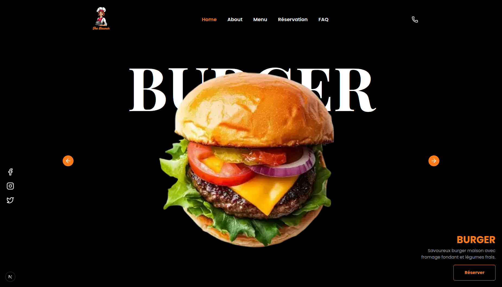

# 🍽️ MHT Restaurant Landing Page


*Screenshot of the landing page*

---

## 🚀 Description

**MHT Restaurant Landing Page** is a **modern and responsive landing page for a restaurant**, built with cutting-edge web technologies to deliver a smooth and elegant user experience.

It is built with:

- **Next.js 15 (App Router)** and **TypeScript**
- **TailwindCSS v4** for modern and fast styling
- **Shadcn/UI (Sonner, Button, Card, etc.)** for reusable components
- **Framer Motion** for smooth animations
- **AOS (Animate on Scroll)** for scroll-based effects
- **Lucide Icons** for clean and lightweight icons

This landing page includes:

- Engaging Hero section
- About section (restaurant presentation)
- Digital menu access (via QR code or button)
- Reservation form with working email submission (SMTP Gmail)
- Interactive FAQ
- Responsive footer

---

## 💻 Installation

1. **Clone the project:**

```bash
git clone https://github.com/MHTech229/mht-restaurant-landing-page-001.git
cd mht-restaurant-landing-page-001
```


2. **Install dependencies:**

<pre class="overflow-visible!" data-start="1269" data-end="1310"><div class="contain-inline-size rounded-2xl relative bg-token-sidebar-surface-primary"><div class="sticky top-9"><div class="absolute end-0 bottom-0 flex h-9 items-center pe-2"><div class="bg-token-bg-elevated-secondary text-token-text-secondary flex items-center gap-4 rounded-sm px-2 font-sans text-xs"></div></div></div><div class="overflow-y-auto p-4" dir="ltr"><code class="whitespace-pre! language-bash"><span><span>npm install
</span><span># or</span><span>
yarn install
</span></span></code></div></div></pre>

3. **Set up environment variables** in `.env.local`:

<pre class="overflow-visible!" data-start="1368" data-end="1574"><div class="contain-inline-size rounded-2xl relative bg-token-sidebar-surface-primary"><div class="sticky top-9"><div class="absolute end-0 bottom-0 flex h-9 items-center pe-2"><div class="bg-token-bg-elevated-secondary text-token-text-secondary flex items-center gap-4 rounded-sm px-2 font-sans text-xs"></div></div></div><div class="overflow-y-auto p-4" dir="ltr"><code class="whitespace-pre! language-env"><span>SMTP_HOST="smtp.gmail.com"
SMTP_PORT="587"
SMTP_SECURE=false
SMTP_USER="your-email@gmail.com"
SMTP_PASS="your-app-password"
FROM_EMAIL="your-email@gmail.com"
TO_EMAIL="noreply@yourrestaurant.org"
</span></code></div></div></pre>

⚠️ For Gmail, you must generate an **App Password** from your Google Account (do not use your main password).

---

## ⚡ Development

Run the development server:

<pre class="overflow-visible!" data-start="1745" data-end="1782"><div class="contain-inline-size rounded-2xl relative bg-token-sidebar-surface-primary"><div class="sticky top-9"><div class="absolute end-0 bottom-0 flex h-9 items-center pe-2"><div class="bg-token-bg-elevated-secondary text-token-text-secondary flex items-center gap-4 rounded-sm px-2 font-sans text-xs"></div></div></div><div class="overflow-y-auto p-4" dir="ltr"><code class="whitespace-pre! language-bash"><span><span>npm run dev
</span><span># or</span><span>
yarn dev
</span></span></code></div></div></pre>

* Open [http://localhost:3000](http://localhost:3000)
* Hot reload is enabled, so your changes are reflected instantly

---

## 📦 Useful Scripts

* `npm run dev` – Start development server
* `npm run build` – Create production build
* `npm start` – Run production build
* `npm run lint` – Check code quality with ESLint

---

## 🌐 Deployment

This project can be easily deployed on **Vercel** (recommended),  **Netlify** , or any platform supporting Next.js.

1. **Create a production build:**

<pre class="overflow-visible!" data-start="2299" data-end="2324"><div class="contain-inline-size rounded-2xl relative bg-token-sidebar-surface-primary"><div class="sticky top-9"><div class="absolute end-0 bottom-0 flex h-9 items-center pe-2"><div class="bg-token-bg-elevated-secondary text-token-text-secondary flex items-center gap-4 rounded-sm px-2 font-sans text-xs"></div></div></div><div class="overflow-y-auto p-4" dir="ltr"><code class="whitespace-pre! language-bash"><span><span>npm run build
</span></span></code></div></div></pre>

2. **Deploy on Vercel:**
   * Connect your GitHub repository to Vercel
   * Vercel automatically detects Next.js App Router and sets up the deployment

---

## 🏗️ Project Structure

<pre class="overflow-visible!" data-start="2517" data-end="2925"><div class="contain-inline-size rounded-2xl relative bg-token-sidebar-surface-primary"><div class="sticky top-9"><div class="absolute end-0 bottom-0 flex h-9 items-center pe-2"><div class="bg-token-bg-elevated-secondary text-token-text-secondary flex items-center gap-4 rounded-sm px-2 font-sans text-xs"></div></div></div><div class="overflow-y-auto p-4" dir="ltr"><code class="whitespace-pre!"><span><span>app/
├─ components/        </span><span># Reusable components (Navbar, Footer, FAQ, etc.)</span><span>
│  └─ ui/             </span><span># Buttons, inputs, cards, etc.</span><span>
├─ (sections)/        </span><span># Page sections (home, about, menu, reservation, faq)</span><span>
├─ globals.css        </span><span># Global styles (Tailwind + custom)</span><span>
├─ layout.tsx         </span><span># Root layout</span><span>
└─ page.tsx           </span><span># Main landing page</span><span>
</span><span>public</span><span>/               </span><span># Images, QR code, and static assets</span><span>
</span></span></code></div></div></pre>

---

## ✨ Features

* 🎨 Modern, responsive design
* 📱 QR Code access to the digital menu
* 📩 Reservation form with email sending via **SMTP Gmail**
* ❓ Interactive FAQ
* ⚡ Smooth animations (Framer Motion + AOS)
* 🌍 Easy deployment on Vercel

---

## 🛠️ Built With

* **Next.js 15 (App Router)**
* **TypeScript**
* **TailwindCSS v4**
* **Shadcn/UI (Sonner, Button, etc.)**
* **Framer Motion**
* **AOS (Animate on Scroll)**
* **Lucide Icons**
* **Nodemailer (SMTP Gmail)**

---

## 👨‍💻 Author

**MEHINTO Charbel** – Fullstack Developer

* [LinkedIn](https://www.linkedin.com/in/ange-marie-charbel-mehinto/)
* [GitHub](https://github.com/MHTech229)

---

## 📝 License

This project is licensed under the **MIT License** – see the [LICENSE]() file for details.
